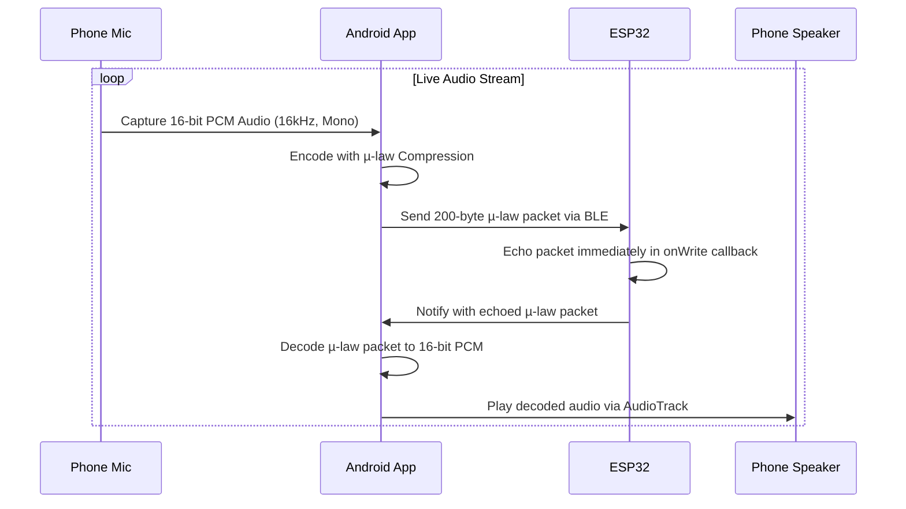

# WiFi Mesh Audio Communication System

## 🎯 Project Overview
A multi-device audio communication system (intercom) using ESP32-S3 devices with the following chain:
```
Phone A <-> BLE <-> ESP32 A (Coordinator) <-> ESP-NOW Mesh <-> ESP32 B (Client) <-> BLE <-> Phone B
```

## 🎶 Live BLE Audio Echo Pipeline (Phone <-> ESP32)

As a core milestone, a full-duplex, live audio echo feature has been implemented to test the real-time audio capabilities of the system. This pipeline serves as the foundation for the larger mesh network.



### **Android App Components**
- **Role**: BLE Client.
- **Audio Capture**: Uses `AudioRecord` to capture 16kHz, 16-bit mono PCM audio from the device microphone. A priming loop ensures the mic is delivering real audio data before streaming begins.
- **Compression**: The raw PCM audio is compressed on-the-fly to 8-bit µ-law format using a custom `MuLawCodec`. This crucial step halves the data rate, making it suitable for the limited bandwidth of BLE.
- **BLE Communication**: Manages sending the µ-law packets and receiving the echoed packets via a single BLE characteristic.
- **Decompression & Playback**: The echoed µ-law packets are decoded back into 16-bit PCM. An `AudioTrack` instance, configured for low-latency voice communication, plays the audio.
- **Buffering**: A jitter buffer (`LinkedBlockingQueue`) is used to smooth out playback, absorbing network timing variations and preventing audio glitches.
- **Concurrency**: The entire process—capture, encoding, sending, receiving, decoding, and playback—is managed within a single, unified background coroutine (`unifiedAudioLoop`) to eliminate race conditions and ensure stable, full-duplex operation.

### **ESP32 Firmware Components**
- **Role**: BLE Server.
- **Echo Logic**: The firmware implements an extremely lightweight "mirror" echo. Upon receiving data in the `onWrite` characteristic callback, it immediately uses that same data to call `setValue()` and `notify()`, sending it right back to the Android client.
- **Efficiency**: No significant buffering, processing, or task switching occurs on the ESP32 for the echo. This makes the turnaround near-instantaneous and adds minimal latency to the audio round-trip.

## 🏗️ System Architecture

### **ESP32 A (Coordinator)**
- **Role**: Mesh Coordinator + BLE Server for Phone A
- **Device Name**: `ESP32S3_Audio_Server`
- **Service UUID**: `4fafc201-1fb5-459e-8fcc-c5c9c331914b`
- **Functions**: 
  - Receives audio from Phone A via BLE
  - Manages ESP-NOW mesh network
  - Broadcasts audio to all connected mesh clients
  - Coordinates up to 4 devices

### **ESP32 B (Client)**
- **Role**: Mesh Client + BLE Server for Phone B
- **Device Name**: `ESP32_B_Client`
- **Service UUID**: `4fafc201-1fb5-459e-8fcc-c5c9c331914b` (Same as coordinator)
- **Functions**:
  - Receives audio from mesh coordinator via ESP-NOW
  - Forwards audio to Phone B via BLE
  - Joins mesh network automatically

## 📱 Android Application
- **App Name**: BLE Audio
- **Functionality**: Audio recording, transmission, and playback
- **Same app used for both Phone A and Phone B**
- **Audio streaming with push-to-talk intercom functionality**

## 🔧 Technical Specifications

### **Hardware**
- **ESP32-S3-DevKitC-1 v1.0** (Both devices)
- **Onboard RGB LED** (NeoPixel) for status indication
- **WiFi + Bluetooth 5.0 LE** support

### **Communication Protocols**
- **BLE (Bluetooth Low Energy)**: Phone ↔ ESP32 communication
- **ESP-NOW**: Direct ESP32 ↔ ESP32 mesh communication
- **Independent of external WiFi router**

### **Audio Specifications**
- **Sample Rate**: Optimized for intercom quality
- **Compression**: Run-Length Encoding (RLE) + 4-bit packing
- **Chunking**: Audio data split into manageable chunks
- **Message Format**: Compact string format for ESP-NOW compatibility

## 📁 Project Structure

```
wifi-mesh/
├── src/                          # ESP32 A (Coordinator) - PlatformIO
│   └── main.cpp                 # Main coordinator firmware
├── esp32_b_project/             # ESP32 B (Client) - PlatformIO
│   └── src/main.cpp            # Main client firmware
├── esp32_b_client/              # ESP32 B (Client) - Arduino .ino
│   └── esp32_b_client.ino      # Arduino-compatible client firmware
├── android/                     # Android application
│   └── app/src/main/java/...   # Kotlin source code
├── test_scripts/                # Python testing scripts
│   ├── simple_serial_test.py
│   ├── data_validation_test.py
│   ├── test_ble_forwarding.py
│   └── test_ble_discovery.py
└── README.md                    # This file
```

## 🚀 Current Status

### **✅ COMPLETED**
1. **ESP32 A (Coordinator)**: ✅ Working - BLE server + ESP-NOW mesh coordinator
2. **ESP-NOW Mesh Communication**: ✅ Working - Stable peer-to-peer communication
3. **Audio Streaming**: ✅ Working - Audio chunks with compression and validation
4. **Android App**: ✅ Working - Audio capture and playback
5. **Mesh Architecture**: ✅ Working - Multi-device support (up to 4 devices)
6. **LED Status Indicators**: ✅ Working - Visual feedback for all states

### **⚠️ CURRENT ISSUE**
**ESP32 B BLE Server Not Advertising**
- **Problem**: Only one BLE device visible ("Audio_server")
- **Expected**: Two BLE devices visible
- **Root Cause**: BLE server on ESP32 B not starting/advertising properly

### **🔍 ATTEMPTED SOLUTIONS**
1. **PlatformIO Firmware**: ❌ BLE server initialization issues
2. **Arduino .ino Conversion**: ❌ BLE server still not advertising
3. **Service UUID Fix**: ✅ Applied (both devices now use same UUID)
4. **Robust BLE Implementation**: ✅ Added error handling and recovery

## 🛠️ Development Environment

### **ESP32 Development**
- **PlatformIO**: Primary development (ESP32 A)
- **Arduino CLI**: Alternative approach (ESP32 B)
- **Libraries**: WiFi, ESP-NOW, BLE, ArduinoJson, Adafruit NeoPixel

### **Testing Tools**
- **Python Scripts**: Serial communication and data validation
- **Serial Monitor**: Real-time debugging and monitoring
- **ESP-NOW Testing**: PC-based mesh communication testing

## 📊 Key Features Implemented

### **Mesh Management**
- **Dynamic Device Discovery**: Clients broadcast join requests
- **Automatic Peer Management**: Coordinator adds/removes devices
- **Heartbeat Monitoring**: Connection health monitoring
- **Timeout Handling**: Automatic reconnection on failures

### **Audio Processing**
- **Chunked Streaming**: Audio split into ESP-NOW compatible chunks
- **Data Compression**: RLE + 4-bit packing for efficiency
- **End-to-End Validation**: Checksums and data integrity checks
- **BLE Forwarding**: Audio relay from mesh to Phone B

### **Error Handling**
- **BLE Recovery**: Automatic server restart on failures
- **Mesh Reconnection**: Automatic rejoin on connection loss
- **Buffer Management**: Overflow prevention and memory safety
- **Status Monitoring**: Comprehensive error logging

## 🎯 Next Steps (Tomorrow)

### **Priority 1: Fix ESP32 B BLE Issue**
1. **Complete Code Review**: Check all BLE initialization code
2. **Serial Debugging**: Monitor ESP32 B startup and BLE status
3. **Alternative BLE Approach**: Try different BLE library or configuration
4. **Hardware Verification**: Confirm ESP32 B is functioning correctly

### **Priority 2: Complete Audio Chain Testing**
1. **Phone A → ESP32 A**: ✅ Already working
2. **ESP32 A → ESP32 B**: ✅ Already working  
3. **ESP32 B → Phone B**: ⚠️ BLE forwarding needs BLE server fix
4. **End-to-End Audio**: Test complete chain once BLE is fixed

### **Priority 3: Multi-Device Expansion**
1. **Add ESP32 C**: Third device to mesh
2. **Add ESP32 D**: Fourth device to mesh
3. **Mesh Load Testing**: Verify stability with 4 devices
4. **Audio Quality Optimization**: Fine-tune compression and streaming

## 🔍 Debugging Commands

### **ESP32 A (Coordinator)**
```bash
# Monitor serial output
python3 -m serial.tools.miniterm /dev/ttyACM0 115200

# Test mesh communication
python3 test_scripts/simple_serial_test.py
```

### **ESP32 B (Client)**
```bash
# Monitor serial output
python3 -m serial.tools.miniterm /dev/ttyACM1 115200

# Test BLE discovery
python3 test_scripts/test_ble_discovery.py
```

### **Arduino CLI (ESP32 B)**
```bash
# Compile .ino file
arduino-cli compile --fqbn esp32:esp32:esp32s3 esp32_b_client.ino

# Flash to ESP32 B
arduino-cli upload --fqbn esp32:esp32:esp32s3 -p /dev/ttyACM1 esp32_b_client.ino
```

## 📋 Known Issues & Solutions

### **ESP-NOW "Invalid argument" Error**
- **Cause**: Message size exceeding 250-byte limit
- **Solution**: ✅ Implemented compact message format and compression

### **Mesh Connection Instability**
- **Cause**: Timeout mismatch between coordinator and client
- **Solution**: ✅ Synchronized DEVICE_TIMEOUT (30s) and MESH_HEARTBEAT_INTERVAL (5s)

### **BLE Device Discovery Issue**
- **Cause**: ESP32 B BLE server not advertising
- **Status**: 🔍 Investigation in progress
- **Attempted**: PlatformIO firmware, Arduino .ino conversion, robust BLE implementation

### **Audio Chunk Parsing Failure**
- **Cause**: Client expecting JSON, coordinator sending compact format
- **Solution**: ✅ Added compact format parsing in client firmware

## 🎵 Audio Specifications

### **Streaming Parameters**
- **Buffer Size**: Optimized for ESP-NOW message limits
- **Chunk Size**: Configurable for different quality/performance trade-offs
- **Compression**: RLE + 4-bit packing for ~60-80% size reduction
- **Quality**: Optimized for voice intercom (not music)

### **Message Format**
```
A:seq:chunk:total:timestamp:sample_rate:bits:min:max:compressed_data
```
- **seq**: Audio sequence number
- **chunk**: Chunk number within sequence
- **total**: Total chunks in sequence
- **timestamp**: Audio timestamp
- **sample_rate**: Audio sample rate
- **bits**: Bits per sample
- **min/max**: Audio value range
- **compressed_data**: Compressed audio binary data

## 🔐 Security & Performance

### **Current Status**
- **Security**: None implemented (as requested)
- **Performance**: Optimized for low-latency intercom
- **Range**: ESP-NOW typical range (100m+ line of sight)
- **Power**: No constraints (as requested)

### **Future Enhancements**
- **Encryption**: ESP-NOW encryption support
- **Authentication**: Device authentication
- **Power Management**: Battery optimization
- **Range Extension**: Mesh relay for extended coverage

## 📞 Contact & Support

### **Project Status**
- **Last Updated**: September 2, 2024
- **Current Phase**: BLE Server Debugging
- **Next Milestone**: Complete Audio Chain Working

### **Key Achievements**
- ✅ Stable ESP-NOW mesh communication
- ✅ Audio streaming with compression
- ✅ Android app integration
- ✅ Multi-device architecture
- ✅ Comprehensive error handling

### **Remaining Work**
- ⚠️ Fix ESP32 B BLE server advertising
- ⚠️ Complete end-to-end audio chain testing
- ⚠️ Add additional mesh devices
- ⚠️ Performance optimization and testing

---

**🚀 Ready to resume tomorrow with complete BLE debugging and audio chain completion!**

